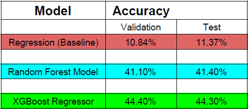
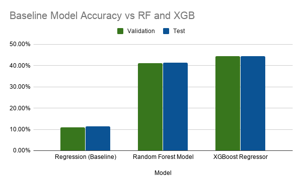
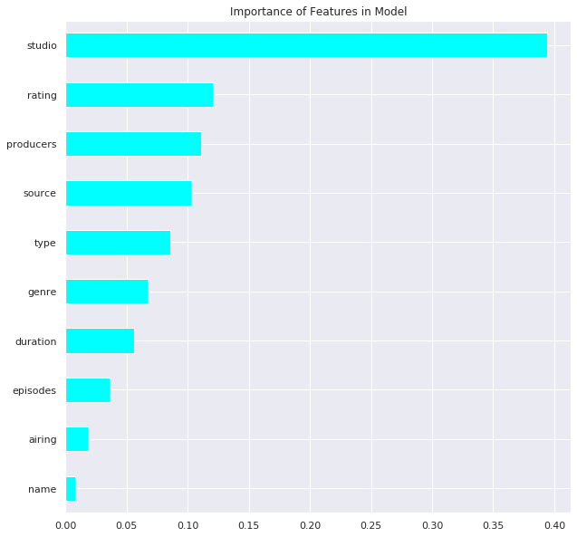

# Anime Rating Prediction Model

#### Welcome! My name is Ivan. This is a project I made as a Lambda School Data Science student.

#### It uses a Kaggle dataset of various Anime and their ratings from an enthusiast website called MyAnimeList.

#### It can be found here:  

### [MyAnimeList Dataset](https://www.kaggle.com/aludosan/myanimelist-anime-dataset-as-20190204)

####  I also wrote two articles on medium about my process and results from the project:

### [Predicting Anime Ratings Part 1](https://medium.com/@incertophile/predicting-anime-ratings-from-myanimelist-data-7bbb6434f258)

### [Predicting Anime Ratings Part 2](https://medium.com/@incertophile/predicting-anime-ratings-from-myanimelist-data-part-2-24fa35190fc6)

   

## Basic Methodology ##

#### I processed and cleaned the dataset, then ran various models to see if I could make a naive prediction on what rating a given anime might get.

#### I used Linear Regression as a baseline, and then tried improving upon it with both Random Forest and XGBoost models, which can be found in the notebooks section. Below is some dataviz using Seaborn (all code in notebook)

### Model Accuracy Comparison

### Feature Importance

